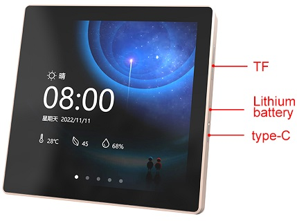
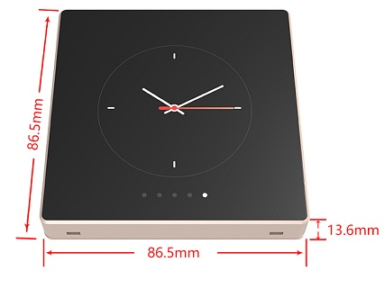

Внешний вид панели ESP32-4848S040:

Схема электрическая принципиальная панели ESP32-4848S040:

Распиновка портов ввода-вывода ESP32-4848S040:
==========================================

| Сигнальная цепь | Обозначение порта ESP32S3 | Примечание |
|:------------------:|:-----:|:-----------------|
| DB1(B) | GPIO 4 | ---- |
| DB2(B)  | GPIO 5 | ---- |
| DB3(B)  | GPIO 6 | ---- |
| DB4(B)  | GPIO 7 | ---- |
| DB5(B) | GPIO 15 | ---- |
| HSYNC | GPIO 16 | ---- |
| VSYNC | GPIO 17 | U1TXD |
| DE | GPIO 18 | U1RXD |
| DB6(G) | GPIO 8 | ---- |
| DB8(G) | GPIO3 |JTAG |
| DB9(G) | IO46 | log |
| DB10(G) | GPIO 9 | ---- |
| ---- | ---- | ---- |
| DB11(G) | GPIO 10 | SPICS0 |
| DB13(G) | GPIO 11 | SPID |
| DB14(G) | GPIO 12 | SPICLK |
| DB15(G) | GPIO 13 | SPIQ |
| DB16(G) | GPIO 14 | ----|
| ---- | ---- | ---- |
| TX | GPIO 43 | U0TXD |
| RX | GPIO 44 | U0RXD |

